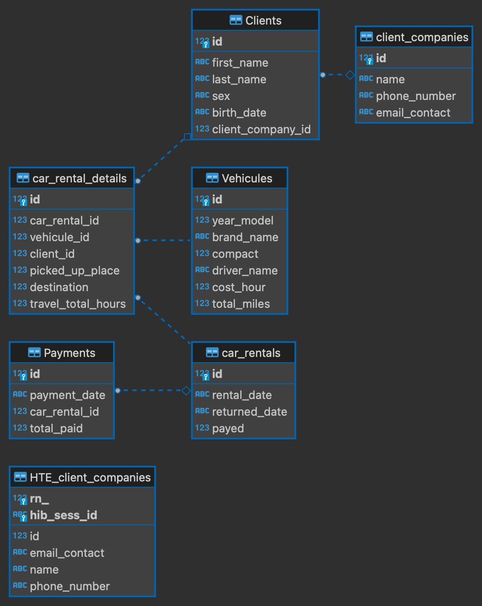

### Enunciado Practica Backend

Una empresa de alquiler de autos especializada a dar servicio a diferentes compañías solicito una api que permita 
gestionar el alquiler dichos vehículos que transportan a los miembros de la compañía con la que trabajan. Para ello 
nos provee de un listado de endpoint a desarrollar

1. FinancialController que tiene los siguientes endpoints:
   1. Listado de alquileres a cobrar a la compañía, (Ver Nombre de la compañía del cliente, nombre completo del cliente
      que alquilo, el codigo del alquiler, datos del vehículo, fecha de entrega y de devolución del vehículo y el 
      total a cobrar para esa compañia (cost_hour del vehiculo por travel_total_hours))
   2. Ingresar un pago, en el body viajan los datos de la fecha de pago, el monto total y el listado de codigos de 
      alquileres que paga
2. CarRental Controller que tiene los siguientes endpoints que tiene las CRUD operations estandar y:
   1. Actualizar un alquiler para que se indique pagado, la URI recibe el id del alquiler.
3. VehicleController que tiene los siguientes endpoints:
   1. Listado de vehículos disponibles (todos los datos)
   2. Agregar un nuevo vehículo
   3. Dar de baja un vehículo
   3. Obtener un vehículo por su id
   4. Actualizar millaje del uso del vehículo  
3. ClientCompanyController que tiene los siguientes endpoints:
   1. Agregar una nueva empresa
   2. Dar de baja una empresa (eso quita todos los empleados), solo si no tiene alquileres impagos
   3. Obtener una empresa por su id
   
4. ClientController que tiene solo las CRUD operation estandar.
   1. Asociar un empleado a una empresa 

Para facilitar nuestro trabajo a la hora de desarrollar la API solicitada, nos provee del modelo de datos

DER - CAR RENTAL

